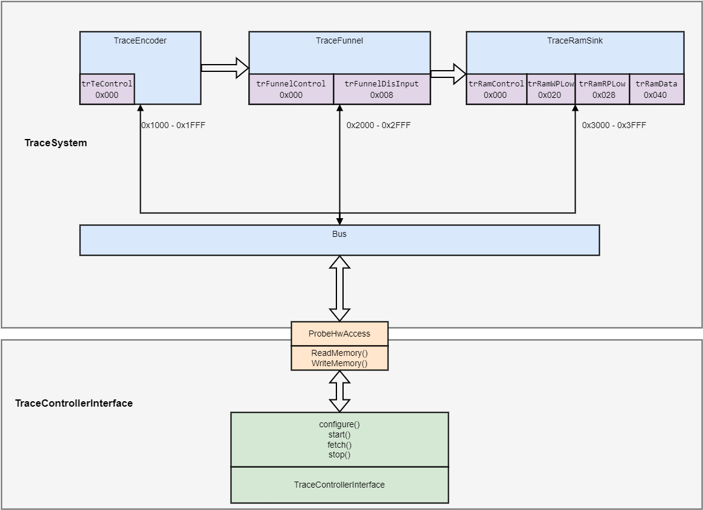

# RISC-V Trace Control Interface — Minimal Software Model

# Trace Subsystem Controller

A spec-aligned modeling and abstraction layer for managing Trace Encoder (TE), Trace Funnel (TF), and Trace RamSink (TRS) hardware components.

## Overview

This project provides a driver-style API and a controller abstraction to manage the lifecycle of trace data—from hardware configuration and signal encoding to data retrieval.

### Features
* **Spec-aligned Modeling:** Precise register definitions including offsets and bitfields for TE, TF, and TRS.
* **Safe Register Access:** Built-in Read-Modify-Write (RMW) helpers to set, clear, and mask fields without corrupting adjacent bits.
* **Driver-style API:** Clean abstraction layer using only `ReadMemory()` and `WriteMemory()` primitives.
* **Validation:** Assertions integrated into the flow to validate register transitions.
* **Lightweight Simulation:** Capable of generating trace words and validating that the `Fetch()` logic operates correctly.

---

## Sequencing & API Reference

The controller sequences operations through four primary stages:

### 1. Configure
Sets up the hardware path. Components must be activated before specific feature bits are applied.

| Component | Register Field | Value | Requirement |
| :--- | :--- | :--- | :--- |
| **TraceEncoder** | `TR_TE_CONTROL[0]` | `1` | **Active**: Write 1 and read back to verify. |
| | `TR_TE_CONTROL[2]` | `1` | **InstTracing**: Must be set before Enable. |
| **TraceFunnel** | `TR_FUNNEL_CONTROL[0]`| `1` | **Active** |
| | `TR_FUNNEL_CONTROL[1]`| `1` | **Enable** |
| | `TR_FUNNEL_DIS_INPUT` | `0` | **Disable Input**: Set bits [15:0] to 0. |
| **TraceRamSink** | `TR_RAM_CONTROL[0]`   | `1` | **Active** |
| | `TR_RAM_CONTROL[1]`   | `1` | **Enable** |

### 2. Start
Activates the tracing stream.

* **TraceEncoder:** Set `TR_TE_CONTROL[1] = 1`.
    > **Note:** The `trTeEnable` bit **must** be set last, only after all other settings (e.g., `trTeInstTracing`, `trTeInstMode`) are confirmed.

### 3. Stop
Gracefully terminates the trace to prevent data loss.

* **TraceEncoder:** `TR_TE_CONTROL[1] = 0`. 
* **TraceFunnel:** `TR_FUNNEL_CONTROL[1] = 0`.
* **TraceRamSink:** `TR_RAM_CONTROL[1] = 0`.

### 4. Fetch
Retrieves stored data from the Sink.

* **Logic:** Continuous polling of pointers. While `!(sinkRamRP == sinkRamWP)`, read `TR_RAM_DATA` 4 bytes (1 word) at a time.
* *Note: This operation does not affect the state of the Encoder or Funnel.*

---

## Limitations & Scope

### Not Modeled
* **Downstream Congestion:** The behavior when the downstream stream is full is currently not modeled.
* **Overflow Logic:** Logic to set and handle the overflow bit is not implemented.

### Requirements
* A target environment supporting `ReadMemory` and `WriteMemory` hooks.

<!--  -->

  

